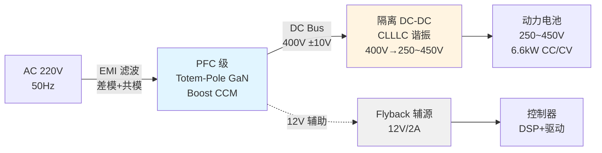
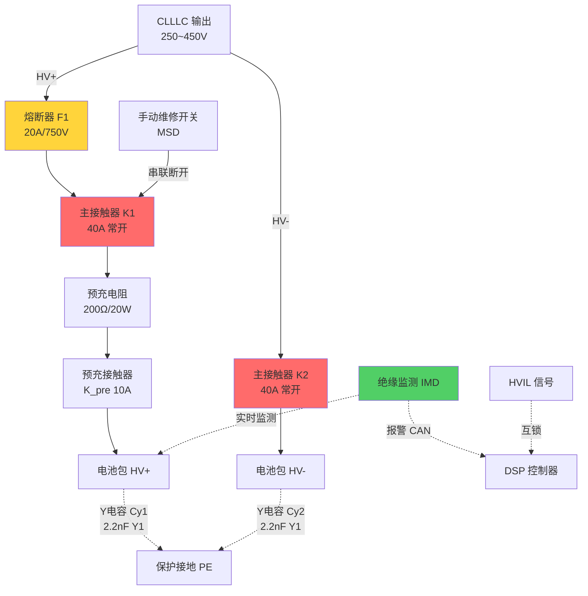

# 6.6kW OBC 技术要求书示例（简化版）

> 本文档为示例，演示技能输出结构。实际使用时会更详细。

---

## 封面信息
- **零部件名称**：车载充电机总成 / On-Board Charger Assembly
- **型号**：OBC-6K6-400-A
- **适用车型**：某新能源乘用车平台
- **版本**：V1.0 | 日期：2026-07-07

---

## 1. 说明 / Overview

### 1.1 范围
本 SOR 规定某新能源汽车平台 6.6kW 单向车载充电机的技术要求、接口定义、测试项目与交付物。

### 1.2 项目信息
- 车型：NEV-Platform-A
- 装配工厂：某基地
- 定点时间：2026 Q3

---

## 2. 总体概述

### 2.1 方案概述
OBC 负责将 AC 220V 市电转换为 DC 250~450V 为动力电池充电，额定功率 6.6kW，效率 ≥95%。

**工作模式**：
- **充电模式**：AC 输入 → PFC + 隔离 DC-DC → 电池包（恒流/恒压）
- **待机模式**：AC 输入，不充电，待机功耗 <5W
- **故障模式**：检测到过温/过流/绝缘故障时停止充电，上报故障码

**关键设计结论**：
- 拓扑：前级 **Totem-Pole GaN PFC**（双向预留） + 后级 **CLLLC 谐振隔离 DC-DC**
- 控制：DSP TMS320F28379D，采样率 100kHz
- 冷却：强制风冷，风扇 12V/0.5A

---

## 3. 产品要求

### 3.1 电气原理图

#### 3.1.1 系统电气拓扑图

#### 3.1.2 高压电气原理图（输出侧）

**图注表**：
| 位号 | 名称 | 规格 | 数量 | 备注 |
|---|---|---|---|---|
| K1/K2 | 主接触器 | 40A/750V DC，线圈 12V | 2 | 常开型 |
| F1 | 熔断器 | 20A/750V DC 快断 | 1 | |
| R_pre | 预充电阻 | 200Ω±5%/20W 陶瓷 | 1 | |
| K_pre | 预充接触器 | 10A/750V | 1 | |
| Cy1/Cy2 | Y 电容 | 2.2nF/500V AC (Y1) | 2 | |
| IMD | 绝缘监测 | Riso>100Ω/V | 1 | CAN 输出 |
| MSD | 手动维修开关 | IP67 带锁 | 1 | |

---

### 3.2 基本参数要求

| 参数 | 规格 | 备注 |
|---|---|---|
| **输入** | | |
| 输入电压 | AC 176~264V | 50/60Hz |
| 输入电流 | ≤32A@220V | 额定功率时 |
| 功率因数 | ≥0.99 | @50%~100%负载 |
| THD | ≤5% | |
| **输出** | | |
| 输出电压 | DC 250~450V | 自适应电池电压 |
| 输出电流 | 0~20A | 可调 |
| 额定功率 | 6.6kW | |
| 输出纹波 | ≤1% Vo | |
| **性能** | | |
| 峰值效率 | ≥97% | @400V/16A |
| 满载效率 | ≥95% | @6.6kW |
| 待机功耗 | <5W | AC 输入，不充电 |
| 功率密度 | ≥2.5kW/L | TBD 体积确认后 |
| **保护** | | |
| 输入过欠压 | 176~264V，超范围停止 | |
| 输出过压 | >480V 停止 | |
| 输出过流 | >25A 限流/停止 | |
| 过温保护 | IGBT Tj>120℃ 降额，>140℃ 停止 | |
| 绝缘故障 | Riso<100Ω/V 报警 | |
| **机械环境** | | |
| 工作温度 | -30~+65℃ | 环境温度 |
| 存储温度 | -40~+85℃ | |
| 防护等级 | IP65 | |
| 冷却 | 强制风冷 | 12V 风扇 |
| 尺寸 | ≤280×200×80mm (L×W×H) | TBD |
| 重量 | ≤3.5kg | TBD |

---

### 3.3 信号定义（主机端，16Pin 连接器）

| Pin | 信号名 | 类型 | 说明 |
|---|---|---|---|
| 1 | CAN_H | 通信 | CAN 高，500kbps |
| 2 | CAN_L | 通信 | CAN 低 |
| 3 | CP | 输入 | 充电控制导引 PWM ±12V |
| 4 | CC1 | 输入 | 连接确认 1 |
| 5 | CC2 | 输入 | 连接确认 2 |
| 6 | HVIL | 输入/输出 | 高压互锁，低电平有效 |
| 7 | +12V | 电源 | 辅助电源 12V/2A |
| 8 | GND | 电源 | 低压地 |
| 9~16 | 预留 | | |

---

## 4. 测试项目表（部分）

| 序号 | 测试项目 | 依据标准 | 合格判据 |
|---|---|---|---|
| 1 | 输入电压范围测试 | GB/T 18487 | 176~264V 正常工作 |
| 2 | 功率因数测试 | | PF≥0.99@50%~100%负载 |
| 3 | 效率测试 | QC/T 895 | 峰值≥97%，满载≥95% |
| 4 | 输出纹波测试 | | ≤1% Vo |
| 5 | 绝缘电阻测试 | GB/T 18384 | ≥100Ω/V |
| 6 | 耐压测试 | | 1800V AC 1min 无击穿 |
| 7 | 过温保护测试 | | Tj>140℃ 停止充电 |
| 8 | EMC 传导骚扰 | GB/T 18655 | Class 5 |
| 9 | EMC 辐射骚扰 | GB/T 18655 | Class 3 |
| 10 | 环境温度测试 | ISO 16750 | -30~+65℃ 额定功率 |

---

## 5. 禁用物质 & 交付资料

### 5.1 禁用物质
符合 RoHS、REACH、GB/T 30512。

### 5.2 交付资料
- 技术方案说明书（拓扑论证、仿真报告）
- 3D 数模（STEP 格式）
- 2D 图纸（装配图、接口图）
- 电气原理图（PDF + 源文件）
- BOM 清单
- DV 测试报告
- 认证报告（CCC、EMC）
- 生产检验规范
- 使用说明书

---

## 附件

### 附件 A：接口定义（详细引脚定义表，略）

### 附件 B：适用标准
- GB/T 18487 电动汽车传导充电系统
- GB/T 18384 电动汽车安全要求
- QC/T 895 电动汽车用传导式车载充电机
- GB/T 18655 (CISPR 25) 车辆 EMC
- ISO 16750 电气电子设备环境条件

### 附件 C：DV 试验明细表（略）

---

**文档结束。本示例展示了技能的输出结构与核心章节。实际使用时会包含更详细的电路原理图、控制逻辑流程图、FMEA 摘要等。**
