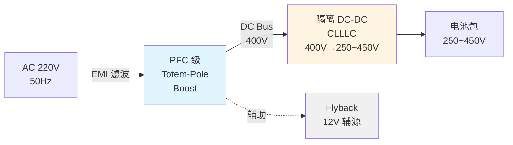
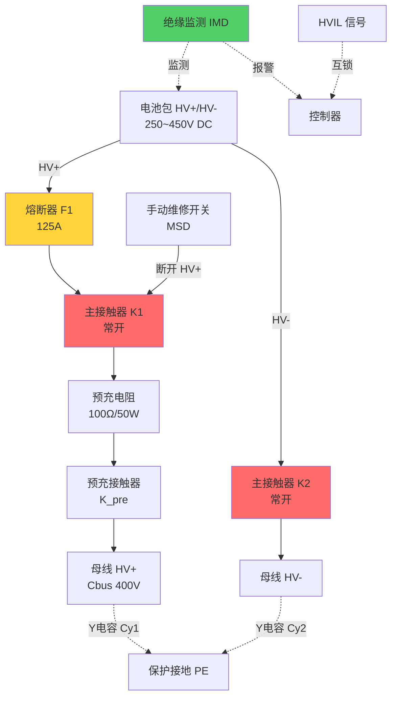
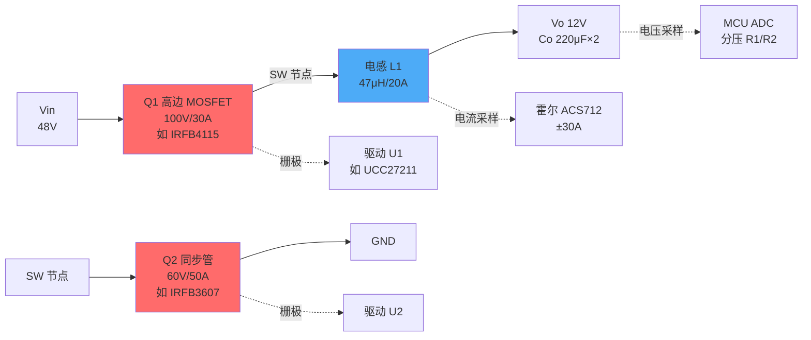
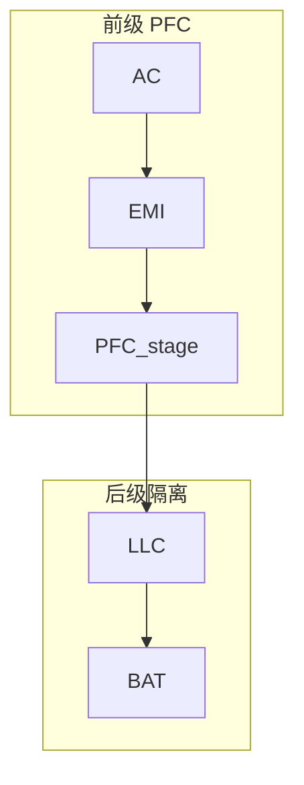
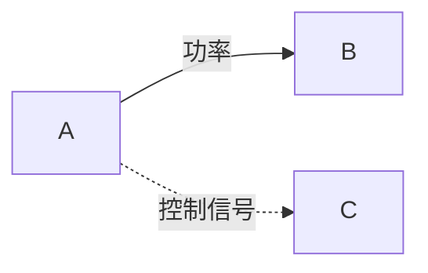

# 图纸绘制规范 / Diagram Drawing Guide

> **最高优先级：技术准确性。** 三类图各有职责，互相独立又互相补充。高压图的安全元素不可省略，拓扑图的连接必须自洽。

---

## 三类图的定义与区别 / Three Types of Diagrams

### 1. 电气拓扑图 / Topology Diagram
**目的**：表达功率流向、变换级联关系、母线电压等级、隔离边界。
**层次**：系统级，框图抽象。
**不画**：具体器件型号、驱动电路、采样电路。
**必含**：输入/输出端口（电压范围）、各功率级框（标注拓扑名称）、母线电压、隔离变压器、滤波级、EMI 滤波器。

**Mermaid 模板（OBC 拓扑示例）**：


**ASCII 拓扑（DC-DC Buck 示例）**：
```
输入 Vin (200~450V)  →  [Buck 变换器]  →  输出 Vo (12V/10A)
                           ↓
                      [控制器 MCU]
                           ↓
                      [驱动 + 采样]
```

### 2. 高压电气原理图 / HV Electrical Schematic
**目的**：高压安全回路设计，满足 GB/T 18384、ISO 6469。
**层次**：高压主回路 + 安全保护元件。
**必含元素（任何高压系统都不可缺）**：
- **HV+ / HV−**：高压正负母线（用粗线，标电压等级如 DC 400V）。
- **K1 / K2**：主接触器（Main Contactor），常态断开，控制 HV 通断。
- **R_pre + K_pre**：预充电阻 + 预充接触器（给母线电容缓慢充电，防浪涌）。
- **F1 / F2**：熔断器 Fuse（过流保护，标额定电流与分断能力）。
- **MSD**：手动维修开关 Manual Service Disconnect（维修时物理断开）。
- **IMD**：绝缘监测装置 Insulation Monitoring Device（实时监测 HV 对地绝缘电阻）。
- **HVIL**：高压互锁 High Voltage Interlock（连接器互锁信号，拔插时先断电）。
- **PE / 接地**：保护接地 / 等电位连接（金属外壳接 PE，标"⏚"）。
- **Y 电容 Cy**：HV+ / HV− 对地 Y 电容（共模滤波，需 X1/Y1 安规电容）。
- **爬电距离 / 电气间隙**：标注关键点间距（如 HV+ 到 HV− ≥8mm@400V）。

**Mermaid 高压原理示例（OBC 输入侧）**：


**图注表（必配）**：
| 位号 | 名称 | 规格/型号 | 数量 | 备注 |
|---|---|---|---|---|
| K1/K2 | 主接触器 | TBD（≥125A，线圈 12V） | 2 | 常开型 |
| F1 | 熔断器 | 125A / 500V DC | 1 | 快断 |
| R_pre | 预充电阻 | 100Ω±5% / 50W | 1 | 线绕/陶瓷 |
| K_pre | 预充接触器 | TBD（≥10A） | 1 | |
| Cy1/Cy2 | Y 电容 | 4.7nF / 500V AC (Y1) | 2 | 共模滤波 |
| IMD | 绝缘监测 | ISO 6469，Riso>100Ω/V | 1 | CAN 输出 |
| MSD | 手动维修开关 | IP67 | 1 | 带锁 |

### 3. 电路原理图 / Circuit Schematic
**目的**：具体器件级实现，开关管/二极管/磁件/驱动/采样/控制器引脚。
**层次**：PCB 设计依据。
**必含**：器件位号（Q1/D1/L1/C1/U1）、型号或关键参数（耐压/电流/封装）、驱动电路（栅极电阻 Rg/隔离驱动芯片）、采样电路（霍尔/分流器/运放）、缓冲吸收（RC snubber/RCD 钳位）、磁件绕组极性（·标同名端）、控制器引脚（ADC/PWM/GPIO）。

**Mermaid 电路示例（同步 Buck）**：


**ASCII 电路（Flyback 示例，更详细）**：
```
输入 Vin (85~265V AC) → 整流桥 BD1 → Cbus 400V
                              ↓
         Q1 MOSFET (650V/10A, 如 STW11NM60)
         ↓ D
         ┌─────────┐
     Np ●│         │● Ns (同名端标 ●)
 变压器 T1│  1:0.1  │ 
     (Lm=500μH)   │
         └─────────┘
              ↓
         D2 肖特基 (60V/5A, 如 MBR2060)
              ↓
         Co 1000μF / 50V (电解)
              ↓
         Vo 12V / 3A 输出

RCD 钳位：Q1 漏极 → Rc 100Ω + Cc 10nF + Dclamp UF4007 → Cbus

驱动：U1 (如 IR2153) PWM → 栅极 Rg 10Ω → Q1 G
反馈：光耦 PC817 + TL431，Vo 采样 → 隔离 → U1 FB 引脚
```

---

## 绘图工具与交付格式 / Tools & Deliverables

| 工具 | 用途 | 优势 | 交付物 |
|---|---|---|---|
| **Mermaid** | 拓扑图、高压框图 | Markdown 嵌入，版本管理友好 | .md 文档内嵌 |
| **ASCII 电路** | 简单电路示意 | 纯文本，快速沟通 | .txt / .md 代码块 |
| **专业 EDA** | 最终电路原理图 | 符合 PCB 设计规范 | KiCad/Altium/OrCAD 工程文件 |
| **绘图软件** | 高压原理图美化 | 可视化好 | Visio/Draw.io/Inkscape |

**本技能输出策略**：
- **拓扑图** → Mermaid（可直接渲染）。
- **高压原理图** → Mermaid 或 ASCII + 说明"建议用 Draw.io/Visio 美化并标注爬电距离"。
- **电路原理图** → ASCII + 器件表，并标注"建议用 KiCad/Altium Designer 绘制正式原理图，本文档提供器件清单与连接逻辑供参考"。

---

## 自洽性检查清单 / Consistency Checklist

**拓扑图**：
- [ ] 输入/输出电压标注清晰（范围/额定）。
- [ ] 每个功率级标明拓扑类型（Buck/LLC/DAB…）。
- [ ] 隔离边界用虚线/标注"隔离变压器"。
- [ ] 功率流方向箭头正确（单向/双向）。

**高压原理图**：
- [ ] HV+/HV− 粗线且标电压等级。
- [ ] 主接触器 K1/K2 存在且常态标注（常开/常闭）。
- [ ] 预充回路（R_pre + K_pre）并联于主回路。
- [ ] 熔断器 F 在接触器前或后（就近电源侧）。
- [ ] MSD 手动维修开关在主回路可断开位置。
- [ ] 绝缘监测 IMD 连接 HV+/HV− 与地。
- [ ] HVIL 信号接入控制器（低压侧）。
- [ ] Y 电容 Cy 接 HV 对地，标注容值与耐压（X1/Y1）。
- [ ] 保护接地 PE 连接金属外壳。
- [ ] 关键点爬电距离标注（≥8mm@400V，依 GB/T 18384）。

**电路原理图**：
- [ ] 开关桥臂上下管不得直通（同一时刻只有一个导通，有死区）。
- [ ] 变压器/电感同名端标注一致（●或点）。
- [ ] 整流二极管方向正确（阳极接低电位，阴极接高电位）。
- [ ] 电容极性正确（电解电容+接高电位，−接低电位）。
- [ ] 驱动电路隔离（光耦/隔离驱动芯片）与非隔离明确。
- [ ] 栅极电阻 Rg / 驱动电源（Vgs）标注。
- [ ] 采样电路量程与 ADC 输入匹配（0~3.3V / 0~5V）。
- [ ] 缓冲吸收（RC/RCD）位置合理（跨开关管/二极管/变压器初级）。
- [ ] 所有器件有位号（Q1/D1/L1/C1/U1）且图注表补齐。

---

## Mermaid 进阶技巧 / Mermaid Advanced

**样式定制**：
```mermaid
%%{init: {'theme':'base', 'themeVariables': { 'primaryColor':'#ffcccc','lineColor':'#333'}}}%%
```

**子图分组**（模块化）：


**虚线表示控制/监测**：


---

## 常见错误与纠正 / Common Mistakes

| 错误 | 后果 | 正确做法 |
|---|---|---|
| 高压图缺预充回路 | 上电瞬间电容充电电流 >1000A，烧接触器 | 必加 R_pre + K_pre |
| 桥臂上下管同时导通 | 直通短路 | 标注死区时间（如 500ns） |
| 变压器同名端反接 | 输出电压极性错误 | ● 标同名端，副边整流二极管方向匹配 |
| Y 电容用普通电容 | 失效短路时 HV 直接接地，致命 | 必须 X1/Y1 安规电容 |
| 爬电距离不足 | 高压拉弧、绝缘失效 | 8mm@400V、12mm@800V 起（依污染等级） |
| 缺 HVIL | 带电拔插高压连接器 | 互锁信号先于功率断开 |
| 电流采样饱和 | 过流保护失效 | 霍尔量程 ≥1.5 倍峰值电流 |

---

## 输出示例结构 / Output Structure Example

完整技术文件中，图纸章节组织：

**3.2 电气原理图 / Electrical Schematics**
- 3.2.1 系统电气拓扑图（Mermaid 渲染）
- 3.2.2 高压电气原理图（Mermaid + 图注表）
- 3.2.3 PFC 级电路原理图（ASCII + 器件表，标注"详细原理图见附件 KiCad 工程"）
- 3.2.4 隔离 DC-DC 级电路原理图（同上）
- 3.2.5 辅助电源电路原理图（同上）

**附件 F 完整原理图**（可选，如果已有 KiCad/Altium 文件）：
- F1_OBC_Main_Schematic.pdf
- F2_Control_Board_Schematic.pdf
- F3_Driver_Board_Schematic.pdf
